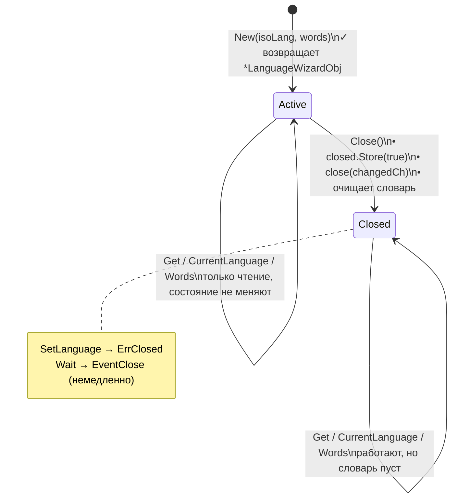
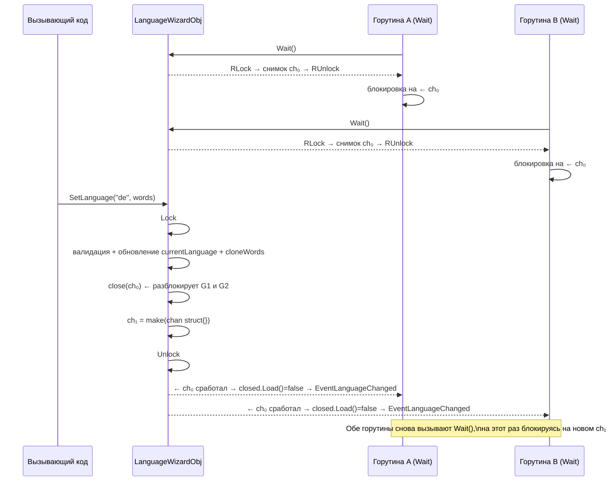
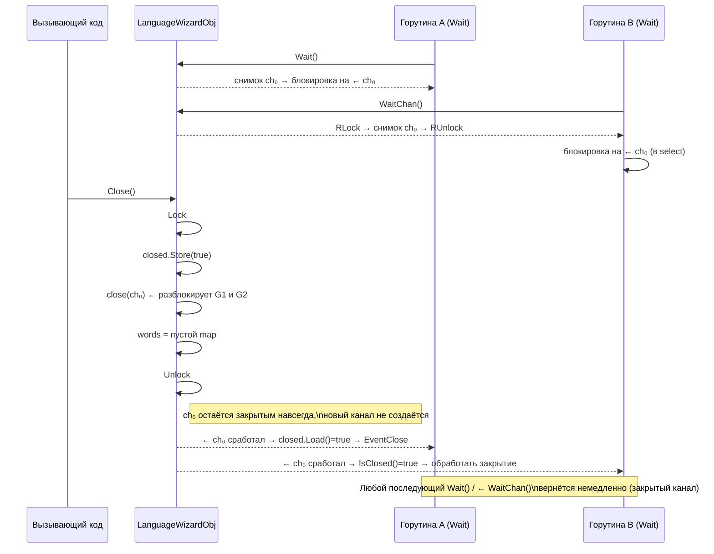
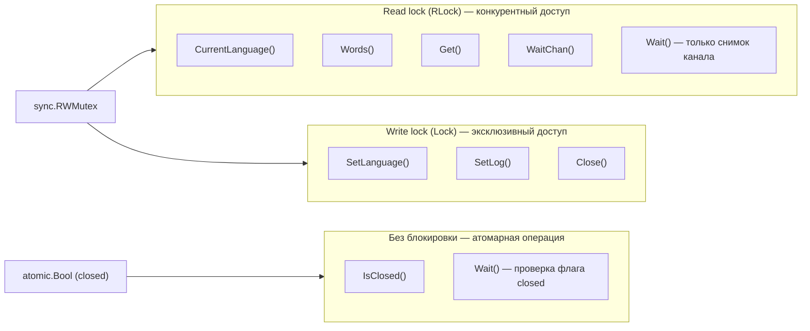

[](https://goreportcard.com/report/github.com/voluminor/language_wizard)


> [English version](README.md)

# language-wizard

*Маленькое потокобезопасное i18n хранилище ключ–значение с горячей сменой языка и простой моделью событий.*

## Обзор

`language-wizard` — минималистичный помощник для приложений, которым нужна простая словарная i18n. Хранит текущий
ISO-код языка и словарь строк перевода в памяти, позволяет атомарно переключать активный язык и предоставляет
небольшой механизм событий для фоновых горутин, которые должны реагировать на смену языка или закрытие объекта.
Внутреннее состояние защищено `sync.RWMutex` для конкурентного доступа.

### Жизненный цикл объекта



## Возможности

* **Простой словарь ключ–значение** для переводов.
* **Горячая смена языка** с атомарной заменой словаря.
* **Потокобезопасное чтение/запись** через RWMutex.
* **Защитное копирование** при передаче словаря вызывающему коду.
* **Блокирующее ожидание** смены языка или закрытия через модель событий.
* **Подключаемый логгер** для отсутствующих ключей.

## Установка

```bash
go get github.com/voluminor/language_wizard
```

Или скопируйте пакет `language_wizard` в дерево исходников вашего проекта.

## Быстрый старт

```go
package main

import (
	"fmt"
	"log"
	"github.com/voluminor/language_wizard"
)

func main() {
	obj, err := language_wizard.New("en", map[string]string{
		"hi": "Hello",
	})
	if err != nil {
		log.Fatal(err)
	}

	// Поиск с дефолтным значением
	fmt.Println(obj.Get("hi", "DEF"))  // "Hello"
	fmt.Println(obj.Get("bye", "Bye")) // "Bye" (и логирует "undef: bye")

	// Опционально: подключить логгер для пропущенных ключей
	obj.SetLog(func(s string) {
		log.Printf("language-wizard: %s", s)
	})

	// Смена языка во время работы
	_ = obj.SetLanguage("de", map[string]string{
		"hi": "Hallo",
	})

	fmt.Println(obj.CurrentLanguage()) // "de"
	fmt.Println(obj.Get("hi", "DEF"))  // "Hallo"
}
```

`New` проверяет, что ISO-код языка не пустой, а словарь не равен `nil` и не пустой. Переданный словарь
защитно копируется.
`Get` возвращает дефолтное значение, если ключ пустой или отсутствует, и логирует неизвестные ключи через
настроенный логгер.

## Концепции и API

### Создание

```go
obj, err := language_wizard.New(isoLanguage string, words map[string]string)
```

* Возвращает `ErrNilIsoLang`, если `isoLanguage` пустой.
* Возвращает `ErrNilWords`, если `words` равен `nil` или пустой.
* При успехе сохраняет код языка и **копию** `words`, инициализирует внутренний канал событий и устанавливает
  логгер-заглушку (no-op).

### Чтение

```go
lang := obj.CurrentLanguage() // возвращает текущий ISO-код
m := obj.Words() // возвращает КОПИЮ словаря
v := obj.Get(id, def) // возвращает def, если ключ пустой или отсутствует
```

* `CurrentLanguage` и `Words` берут read-блокировку; `Words` возвращает защитную копию, чтобы внешние изменения
  не затронули внутреннее состояние.
* `Get` логирует промахи в формате `"undef: <id>"` через настроенный логгер и возвращает переданное дефолтное
  значение.

#### Схема работы `Get`

```mermaid
flowchart TD
    A([Get&#40;id, def&#41;]) --> B{id == &quot;&quot;?}
B -- да --> Z1([вернуть def])
B -- нет --> C[RLock]
C --> D[val, ok = words&#91;id&#93;\nlogFn = obj.log]
D --> E[RUnlock]
E --> F{ok?}
F -- да --> Z2([вернуть val])
F -- нет --> G[logFn&#40;&quot;undef: &quot; + id&#41;]
G --> Z3([вернуть def])
```



> `logFn` снимается под тем же `RLock`, что и поиск по словарю, поэтому конкурентные вызовы `SetLog`
> не могут создать гонку данных.

### Обновление

```go
err := obj.SetLanguage(isoLanguage string, words map[string]string)
```

* Валидирует входные данные как в `New`; возвращает `ErrNilIsoLang` / `ErrNilWords` при невалидных значениях.
* Возвращает `ErrClosed`, если объект был закрыт.
* Возвращает `ErrLangAlreadySet`, если `isoLanguage` совпадает с текущим.
* При успехе **атомарно заменяет** язык и **копию** переданного словаря, **закрывает** внутренний канал событий
  для уведомления ожидающих горутин, затем создаёт **новый канал** для будущих ожиданий.

### События и ожидание

```go
type EventType byte

const (
EventClose           EventType = 0
EventLanguageChanged EventType = 4
)

ev := obj.Wait() // блокирует до смены языка или закрытия объекта
ok := obj.WaitUntilClosed() // true, если объект был закрыт
```

* `Wait` снимает снимок текущего канала под коротким `RLock`, блокируется на нём, затем атомарно проверяет флаг
  `closed`, чтобы вернуть `EventClose` или `EventLanguageChanged`.
* `WaitUntilClosed` — удобная обёртка, возвращающая `true`, если получено событие закрытия.

#### Схема уведомления при SetLanguage



#### Схема уведомления при Close



**Типичный цикл:**

```go
go func () {
for {
switch obj.Wait() {
case language_wizard.EventLanguageChanged:
// Пересобрать кэши / обновить UI здесь.
case language_wizard.EventClose:
// Очистить ресурсы и выйти.
return
}
}
}()
```

**Цикл с контекстом:**

```go
go func () {
for {
select {
case <-ctx.Done():
return
case <-obj.WaitChan():
if obj.IsClosed() {
// Очистить ресурсы и выйти.
return
}
// Пересобрать кэши / обновить UI здесь.
}
}
}()
```

> Каждая итерация вызывает `obj.WaitChan()`, получая свежий снимок текущего канала — цикл корректно
> переключается на новый канал после каждого `SetLanguage`.

### Логирование

```go
obj.SetLog(func (msg string) { /* ... */ })
```

* Устанавливает пользовательский логгер для промахов при поиске ключа. Передача `nil` сбрасывает логгер обратно
  на встроенную заглушку (no-op). Логгер сохраняется под write-блокировкой.
* Логгер вызывается только в `Get` (при промахе).

### Закрытие

```go
obj.Close()
```

* Идемпотентно. Устанавливает флаг `closed`, **закрывает канал событий** (разблокируя все `Wait`), и очищает
  словарь до пустого map. Последующие вызовы `SetLanguage` вернут `ErrClosed`.

### Ошибки

Экспортированные ошибки:

* `ErrNilIsoLang` — ISO-код языка обязателен в `New`/`SetLanguage`.
* `ErrNilWords` — `words` должен быть не-nil и не пустым в `New`/`SetLanguage`.
* `ErrLangAlreadySet` — попытка установить тот же язык, что уже активен.
* `ErrClosed` — объект закрыт; обновления недопустимы.

## Потокобезопасность и модель конкурентности



Ключевые гарантии:

* `SetLanguage` **закрывает** текущий канал событий для уведомления всех ожидающих, затем сразу **заменяет** его
  новым каналом — последующие `Wait` будут блокироваться до следующего события.
* `Wait` и `WaitChan` снимают снимок канала под минимальным `RLock` — блокировка снимается до начала ожидания,
  поэтому ожидающие горутины никогда не конкурируют с писателями.
* Флаг `closed` — это `atomic.Bool`: чтение (`IsClosed`, проверка после разблокировки в `Wait`) не требует
  никакой блокировки.
* `Get` снимает под одним `RLock` как значение из словаря, так и указатель на функцию `log` — это предотвращает
  гонку с конкурентными вызовами `SetLog`.

## Паттерны использования

### 1) HTTP-обработчики / CLI: получение с дефолтом

```go
func greet(obj *language_wizard.LanguageWizardObj) string {
return obj.Get("hi", "Hello")
}
```

Защищает от отсутствующих ключей, при этом выводя их в лог через логгер.

### 2) Слежение за сменой языка

```go
func watch(obj *language_wizard.LanguageWizardObj) {
for {
switch obj.Wait() {
case language_wizard.EventLanguageChanged:
// например, прогреть шаблоны или инвалидировать кэши
case language_wizard.EventClose:
return
}
}
}
```

Запускайте из горутины, чтобы держать вспомогательное состояние в синхронизации с активным языком.

### 3) Горячая замена языка во время работы

```go
_ = obj.SetLanguage("fr", map[string]string{"hi": "Bonjour"})
```

Все текущие ожидающие горутины получат уведомление; последующие ожидания переключатся на новый канал.

### 4) Пользовательский логгер для отсутствующих ключей

```go
obj.SetLog(func (s string) {
// s выглядит так: "undef: some.missing.key"
})
```

Удобно для сбора телеметрии по пропущенным переводам. Передайте `nil`, чтобы сбросить логгер обратно на заглушку.

## Тестирование

Запустите тесты с детектором гонок:

```bash
go test -race ./...
```

Что покрывается тестами:

* Успешное создание и базовый поиск по ключам.
* Семантика защитного копирования для `Words()`.
* Возврат дефолтного значения в `Get` и логирование промахов.
* `SetLog(nil)` сбрасывает логгер на заглушку без паники.
* Валидация и обработка ошибок в `New`/`SetLanguage`.
* Смена языка и обновление текущего языка.
* Обработка событий: `Wait`, `WaitUntilClosed` и поведение при закрытии.
* `Close` очищает словарь и блокирует дальнейшие обновления.

## FAQ

**В: Почему `Wait` иногда возвращается немедленно при повторном вызове?**
Потому что `SetLanguage` и `Close` **закрывают** текущий канал событий; если вызвать `Wait` снова без последующего
`SetLanguage`, вы всё ещё можете наблюдать уже закрытый канал. Реализация **заменяет** канал после закрытия;
вызывайте `Wait` в цикле и воспринимайте каждый возврат как единственное событие.

**В: Можно ли изменять map, возвращённый `Words()`?**
Да, это копия. Её изменение не затронет внутреннее состояние. Используйте `SetLanguage` для замены внутреннего
словаря.

**В: Что происходит после `Close()`?**
`Wait` разблокируется с `EventClose`, словарь очищается, а `SetLanguage` возвращает `ErrClosed`. Методы чтения
продолжают работать, но словарь пуст, если вы не сохранили внешнюю копию.

## Важные особенности поведения

### `Get` и `CurrentLanguage` на закрытом объекте

После вызова `Close()` методы чтения (`Get`, `CurrentLanguage`, `Words`) остаются полностью работоспособными и
**не** возвращают ошибок и не вызывают панику. Однако `Close()` очищает внутренний словарь до пустого map, поэтому:

* `Get(id, def)` будет **всегда возвращать `def`** для любого ключа и логировать `"undef: <id>"` при каждом
  вызове.
* `CurrentLanguage()` по-прежнему вернёт **последний код языка**, установленный до закрытия, даже если объект
  больше не пригоден для обновлений.
* `Words()` вернёт **пустой map**.

Это означает, что по возвращаемому значению `Get` невозможно отличить "ключ действительно отсутствует в текущем
переводе" от "объект был закрыт". Если ваш код должен обнаруживать закрытие, явно проверяйте `IsClosed()`:

```go
if obj.IsClosed() {
// обработать закрытое состояние
return
}
val := obj.Get("greeting", "Hello")
```

### Поведение `Wait` после `Close()`

После вызова `Close()` внутренний канал событий закрывается навсегда и **никогда не заменяется**. Это имеет
следующие последствия:

* **Первый** вызов `Wait()`, заблокированный в момент `Close()`, корректно разблокируется и вернёт `EventClose`.
* Любые **последующие** вызовы `Wait()` после `Close()` также вернут `EventClose` **немедленно** (чтение из
  закрытого канала в Go возвращает нулевое значение без блокировки).
* Если ваш код вызывает `Wait()` в цикле, он будет **крутиться вхолостую бесконечно** после закрытия, если
  явно не проверять `EventClose` и не выходить:

```go
for {
switch obj.Wait() {
case language_wizard.EventLanguageChanged:
// обработать смену языка
case language_wizard.EventClose:
return // ВАЖНО: здесь необходимо выйти из цикла
}
}
```

Без `return` (или `break`) на `EventClose` цикл превращается в активное ожидание, потребляющее 100% ядра
процессора, так как `Wait()` больше никогда не блокируется после закрытия объекта.

## Ограничения

* Только словарная i18n: нет правил ICU/plural, интерполяции или цепочек fallback — намеренно минималистично.
* `Wait()` не принимает параметр таймаута; используйте `WaitChan()` с `select` и `ctx.Done()` для
  отменяемых ожиданий.
* Сравнение языков строковое; `SetLanguage("en", …)` при уже активном `"en"` вернёт `ErrLangAlreadySet`.
