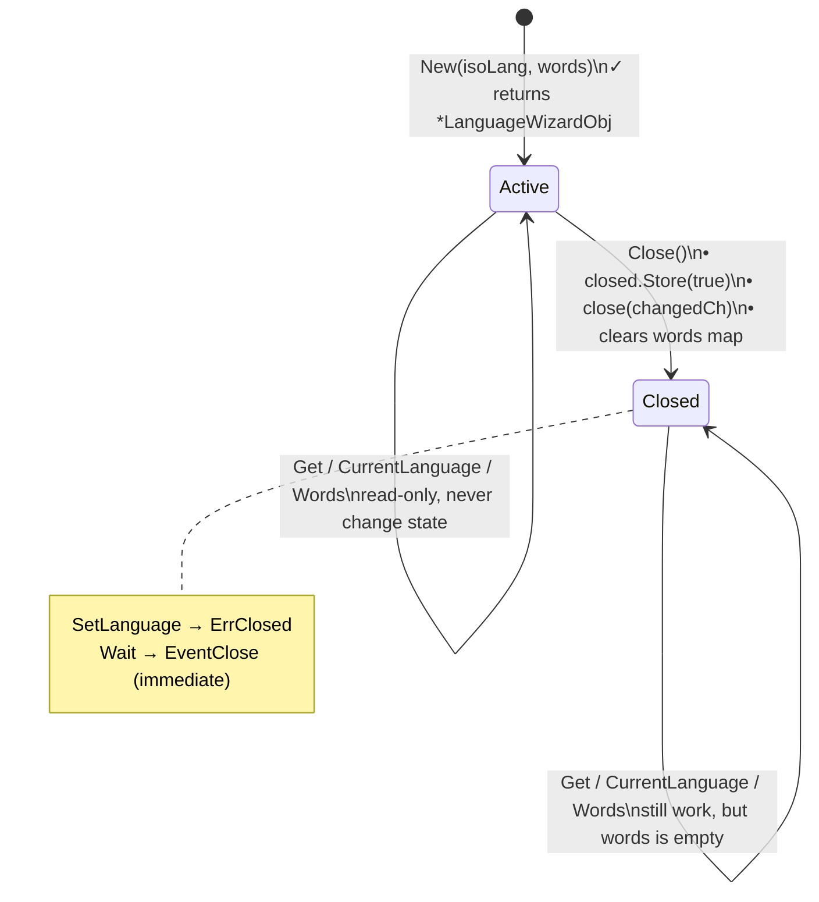
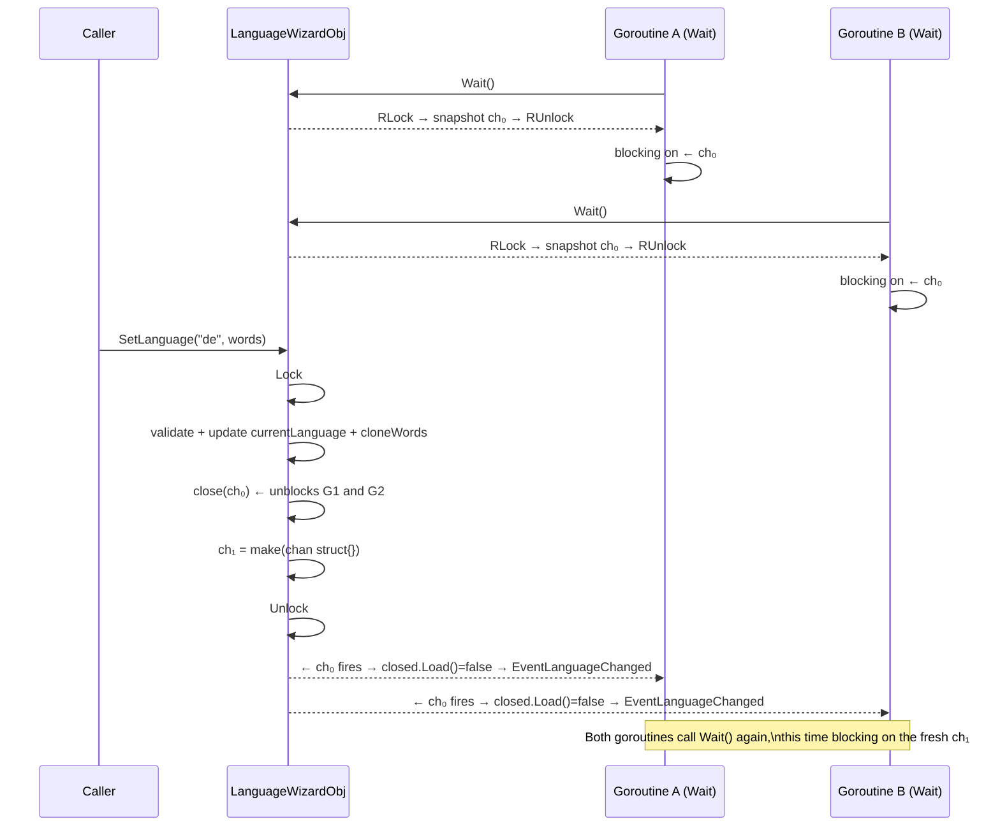
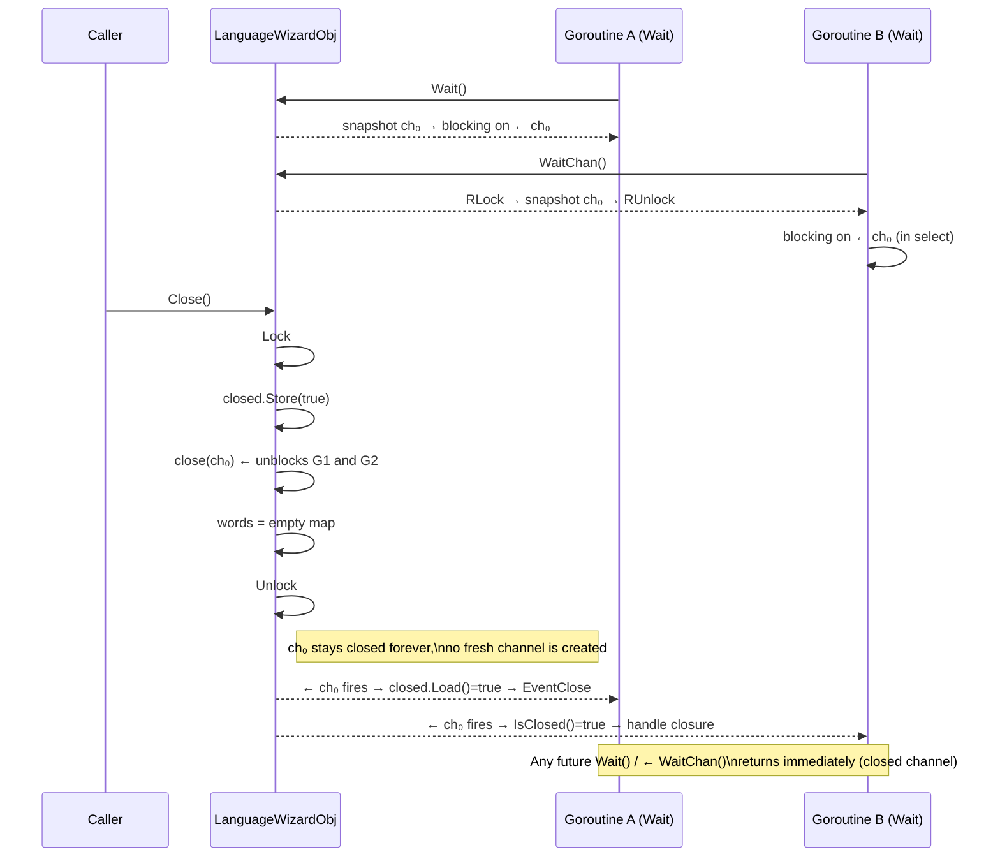
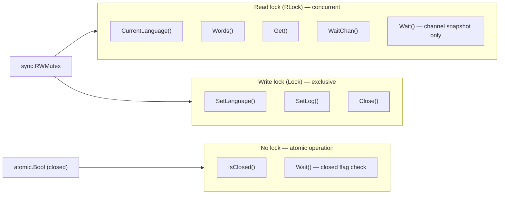

[](https://goreportcard.com/report/github.com/voluminor/language_wizard)


> [Русская версия](README.RU.md)

# language-wizard

*A tiny, thread-safe i18n key–value store with hot language switching and a simple event model.*

## Overview

`language-wizard` is a minimalistic helper for applications that need a simple dictionary-based i18n. It stores the
current ISO language code and an in-memory map of translation strings, lets you switch the active language atomically,
and exposes a small event mechanism so background workers can react to changes or closure. The internal state is guarded
by a `sync.RWMutex` for concurrent access.

### Object Lifecycle



## Features

* **Simple key–value dictionary** for translations.
* **Hot language switching** with atomic swap of the dictionary.
* **Thread-safe reads/writes** guarded by a RWMutex.
* **Defensive copy** when exposing the map to callers.
* **Blocking wait** for language changes or closure via a tiny event model.
* **Pluggable logger** for missing keys.

## Installation

```bash
go get github.com/voluminor/language_wizard
```

Or vendor/copy the `language_wizard` package into your project's source tree.

## Quick Start

```go
package main

import (
  "fmt"
  "log"
  "github.com/voluminor/language_wizard"
)

func main() {
  obj, err := language_wizard.New("en", map[string]string{
    "hi": "Hello",
  })
  if err != nil {
    log.Fatal(err)
  }

  // Lookup with default
  fmt.Println(obj.Get("hi", "DEF"))  // "Hello"
  fmt.Println(obj.Get("bye", "Bye")) // "Bye" (and logs "undef: bye")

  // Optional: hook a logger for misses
  obj.SetLog(func(s string) {
    log.Printf("language-wizard: %s", s)
  })

  // Switch language at runtime
  _ = obj.SetLanguage("de", map[string]string{
    "hi": "Hallo",
  })

  fmt.Println(obj.CurrentLanguage()) // "de"
  fmt.Println(obj.Get("hi", "DEF"))  // "Hallo"
}
```

`New` validates that the ISO language is not empty and the words map is non-nil and non-empty. The initial map is
defensively copied.
`Get` returns a default when the key is empty or missing and logs undefined keys via the configured logger.

## Concepts & API

### Construction

```go
obj, err := language_wizard.New(isoLanguage string, words map[string]string)
```

* Fails with `ErrNilIsoLang` if `isoLanguage` is empty.
* Fails with `ErrNilWords` if `words` is `nil` or empty.
* On success, stores the language code and a **copy** of `words`, initializes an internal change channel, and sets a
  no-op logger.

### Reading

```go
lang := obj.CurrentLanguage() // returns the current ISO code
m := obj.Words() // returns a COPY of the dictionary
v := obj.Get(id, def) // returns def if id is empty or missing
```

* `CurrentLanguage` and `Words` take read locks; `Words` returns a defensive copy so external modifications cannot
  mutate internal state.
* `Get` logs misses in the form `"undef: <id>"` via the configured logger and returns the provided default.

#### `Get` flow

```mermaid
flowchart TD
  A([Get&#40;id, def&#41;]) --> B{id == &quot;&quot;?}
B -- yes --> Z1([return def])
B -- no --> C[RLock]
C --> D[val, ok = words&#91;id&#93;\nlogFn = obj.log]
D --> E[RUnlock]
E --> F{ok?}
F -- yes --> Z2([return val])
F -- no --> G[logFn&#40;&quot;undef: &quot; + id&#41;]
G --> Z3([return def])
```



> `logFn` is snapshotted under the same `RLock` as the map lookup, so concurrent `SetLog` calls cannot race with it.

### Updating

```go
err := obj.SetLanguage(isoLanguage string, words map[string]string)
```

* Validates input as in `New`; returns `ErrNilIsoLang` / `ErrNilWords` on invalid values.
* Returns `ErrClosed` if the object was closed.
* Returns `ErrLangAlreadySet` if `isoLanguage` equals the current one.
* On success, **atomically swaps** the language and a **copy** of the provided map, **closes** the internal change
  channel to notify waiters, then creates a **fresh channel** for future waits.

### Events & Waiting

```go
type EventType byte

const (
EventClose           EventType = 0
EventLanguageChanged EventType = 4
)

ev := obj.Wait() // blocks until language changes or object is closed
ok := obj.WaitUntilClosed() // true if it was closed, false otherwise
```

* `Wait` snapshots the current channel under a short `RLock`, blocks on it, then checks the `closed` flag atomically to
  distinguish `EventClose` from `EventLanguageChanged`.
* `WaitUntilClosed` is a convenience that returns `true` iff the closure event was received.

#### SetLanguage notification flow



#### Close notification flow



**Typical loop:**

```go
go func () {
for {
switch obj.Wait() {
case language_wizard.EventLanguageChanged:
// Rebuild caches / refresh UI here.
case language_wizard.EventClose:
// Cleanup and exit.
return
}
}
}()
```

**Context loop:**

```go
go func () {
for {
select {
case <-ctx.Done():
return
case <-obj.WaitChan():
if obj.IsClosed() {
// Cleanup and exit.
return
}
// Rebuild caches / refresh UI here.
}
}
}()
```

> Each iteration calls `obj.WaitChan()` to get a fresh snapshot of the current channel, so the loop correctly
> latches onto the new channel after every `SetLanguage`.

### Logging

```go
obj.SetLog(func (msg string) { /* ... */ })
```

* Sets a custom logger for undefined key lookups. Passing `nil` resets the logger back to the built-in no-op.
  The logger is stored under a write lock.
* Only `Get` calls the logger (for misses).

### Closing

```go
obj.Close()
```

* Idempotent. Sets the `closed` flag, **closes the change channel** (unblocking all `Wait` calls), and clears the words
  map to an empty one. Further `SetLanguage` calls will fail with `ErrClosed`.

### Errors

Exported errors:

* `ErrNilIsoLang` — ISO language is required by `New`/`SetLanguage`.
* `ErrNilWords` — `words` must be non-nil and non-empty in `New`/`SetLanguage`.
* `ErrLangAlreadySet` — attempted to set the same language as current.
* `ErrClosed` — the object has been closed; updates are not allowed.

## Thread-Safety & Concurrency Model



Key invariants:

* `SetLanguage` **closes** the current change channel to notify all waiters, then immediately **replaces** it with a new
  channel so subsequent `Wait` calls will block until the next event.
* `Wait` and `WaitChan` snapshot the channel under a minimal `RLock` — the lock is released before blocking,
  so waiters never contend with writers.
* The `closed` flag is an `atomic.Bool`: reads (`IsClosed`, post-wait check in `Wait`) require no lock at all.
* `Get` snapshots both the map value and the `log` function pointer under a single `RLock`, preventing a race with
  concurrent `SetLog` calls.

## Usage Patterns

### 1) HTTP handlers / CLIs: fetch with defaults

```go
func greet(obj *language_wizard.LanguageWizardObj) string {
return obj.Get("hi", "Hello")
}
```

This shields you from missing keys while still surfacing them via the logger.

### 2) Watching for changes

```go
func watch(obj *language_wizard.LanguageWizardObj) {
for {
switch obj.Wait() {
case language_wizard.EventLanguageChanged:
// e.g., warm up templates or invalidate caches
case language_wizard.EventClose:
return
}
}
}
```

Use this from a goroutine to keep ancillary state in sync with the active language.

### 3) Hot-swap language at runtime

```go
_ = obj.SetLanguage("fr", map[string]string{"hi": "Bonjour"})
```

All current waiters are notified; subsequent waits latch onto the fresh channel.

### 4) Custom logger for undefined keys

```go
obj.SetLog(func (s string) {
// s looks like: "undef: some.missing.key"
})
```

Great for collecting telemetry on missing translations. Pass `nil` to reset back to the no-op logger.

## Testing

Run the test suite with the race detector:

```bash
go test -race ./...
```

What's covered:

* Successful construction and basic lookups.
* Defensive copy semantics for `Words()`.
* `Get` defaulting and miss logging.
* `SetLog(nil)` resets to no-op without panicking.
* Validation and error cases in `New`/`SetLanguage`.
* Language switching and current language updates.
* Event handling: `Wait`, `WaitUntilClosed`, and close behavior.
* `Close` clears words and blocks further updates.

## FAQ

**Q: Why does `Wait` sometimes return immediately after I call it twice?**
Because `SetLanguage` and `Close` **close** the current event channel; if you call `Wait` again without a
subsequent `SetLanguage`, you may still be observing the already-closed channel. The implementation **replaces** the
channel after closing it; call `Wait` in a loop and treat each return as a single event.

**Q: Can I mutate the map returned by `Words()`?**
Yes, it's a copy. Mutating it won't affect the internal state. Use `SetLanguage` to replace the internal map.

**Q: What happens after `Close()`?**
`Wait` unblocks with `EventClose`, the dictionary is cleared, and `SetLanguage` returns `ErrClosed`. Reads still work
but the dictionary is empty unless you held an external copy.

## Important Behavior Notes

### `Get` and `CurrentLanguage` on a closed object

After `Close()` is called, read methods (`Get`, `CurrentLanguage`, `Words`) remain fully functional and do **not**
return errors or panics. However, `Close()` clears the internal dictionary to an empty map, so:

* `Get(id, def)` will **always return `def`** (the default) for every key and will log `"undef: <id>"` for each call.
* `CurrentLanguage()` will still return the **last language code** that was set before closing, even though the object
  is no longer usable for updates.
* `Words()` will return an **empty map**.

This means there is no way to distinguish "the key is genuinely missing from the current translation" from "the object
has been closed" by looking at `Get` return values alone. If your code needs to detect closure, check `IsClosed()`
explicitly before or after calling `Get`.

```go
if obj.IsClosed() {
// handle closed state
return
}
val := obj.Get("greeting", "Hello")
```

### `Wait` behavior after `Close()`

Once `Close()` is called, the internal change channel is closed permanently and is **never replaced**. This has the
following consequences:

* The **first** `Wait()` call that is blocked at the time of `Close()` will correctly unblock and return `EventClose`.
* Any **subsequent** `Wait()` calls after `Close()` will also return `EventClose` **immediately** (reading from a
  closed channel in Go returns the zero value without blocking).
* If your code calls `Wait()` in a loop, it will **spin indefinitely** after closure unless you explicitly check
  for `EventClose` and break out:

```go
for {
switch obj.Wait() {
case language_wizard.EventLanguageChanged:
// handle language change
case language_wizard.EventClose:
return // IMPORTANT: you must exit the loop here
}
}
```

Without the `return` (or `break`) on `EventClose`, the loop becomes a busy spin that consumes 100% of a CPU core,
because `Wait()` never blocks again after the object is closed.

## Limitations

* Dictionary-only i18n: no ICU/plural rules, interpolation, or fallback chains—intentionally minimal.
* `Wait()` itself has no timeout parameter; use `WaitChan()` with a `select` and `ctx.Done()` for cancellable waits.
* Language identity equality is string-based; `SetLanguage("en", …)` to `"en"` returns `ErrLangAlreadySet`.
